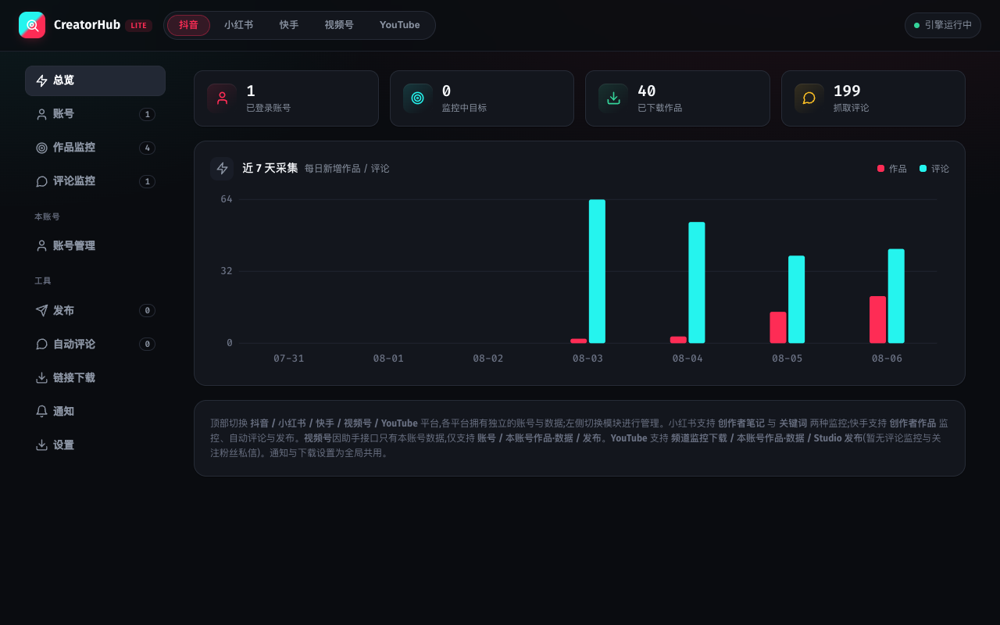
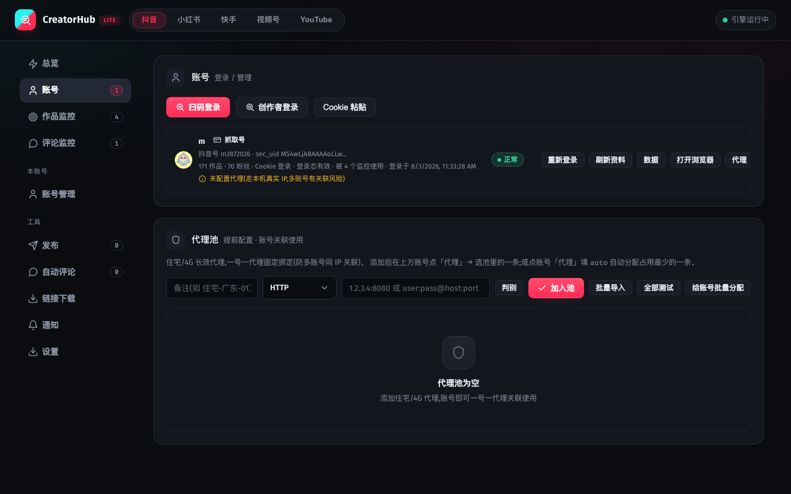
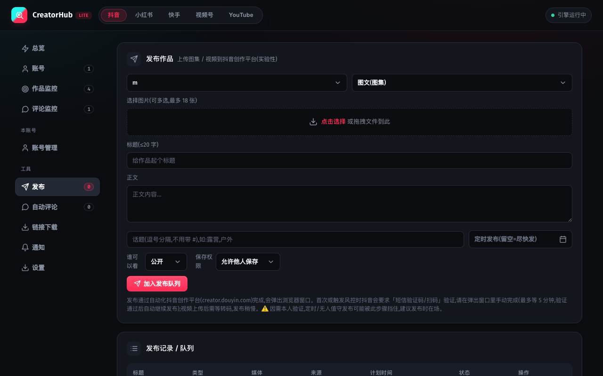
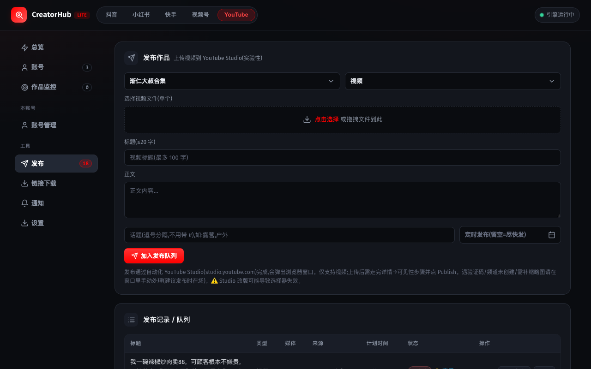
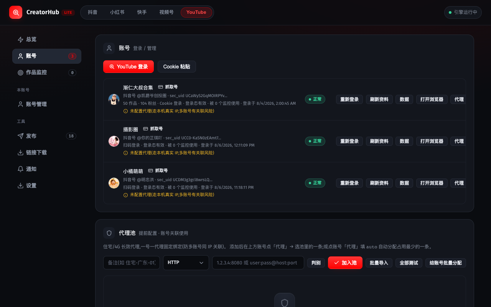
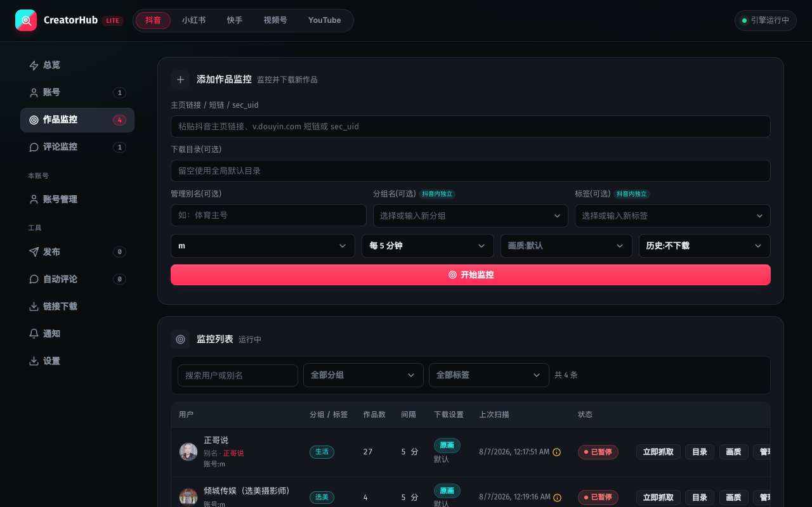
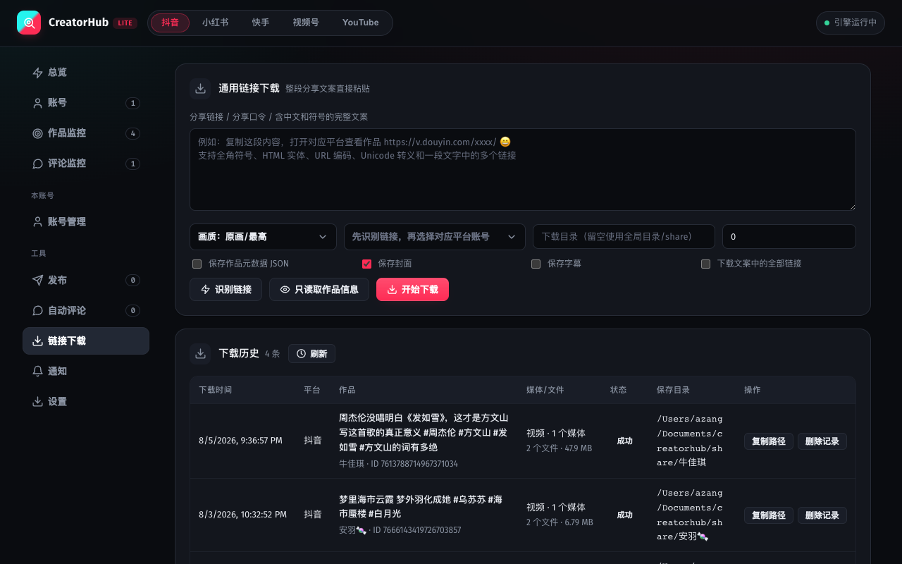

# CreatorHub 图文使用手册

三步就会用：**选平台 → 登录 → 发布 / 下载**。  
按图找按钮即可。

---

## 界面长什么样

记住两块：

| 位置 | 干什么 |
|:---|:---|
| **顶栏** 抖音 / 小红书 / 快手 / 视频号 / YouTube | 先选平台 |
| **左侧菜单** | 再选功能 |

> 换平台 = 换一套账号。必须先点顶栏，再点左侧。

---

## 第 1 步：登录账号

1. 顶栏选好平台  
2. 左侧点 **账号**  
3. 点红色的登录按钮（抖音一般是「扫码登录」）

弹出**另一个浏览器窗口** → 在那个窗口里扫码 / 登录。  
成功后，列表里会出现账号，状态显示绿色 **「正常」**。

| 平台 | 点哪个按钮 |
|:---|:---|
| 抖音 / 快手 | 扫码登录 |
| 小红书 | 要发布请用「创作者登录」 |
| 视频号 | 视频号登录 |
| YouTube | YouTube 登录 → Google 登录 → **选频道** → 会自动关窗 |

状态变成 **「登录失效」**？点「重新登录」。

---

## 第 2 步：发布作品

左侧点 **发布**：

按顺序：

1. 选账号  
2. 选类型（图文 / 视频）  
3. **点击选择** 上传文件  
4. 填标题、正文  
5. 点红色 **「加入发布队列」**  
6. 在下方队列里点 **「立即发布」**（如有）

又会弹出浏览器——验证码、实名等请在弹出窗口里自己点完。  
队列状态变成 **「已发布」** = 成功。

### YouTube 发视频（多看一眼）

- 只能发 **视频**  
- 弹出的 Studio 里要选 **公开**，点 **发布**，不要点「保存」（会变草稿）  
- 面板失败时，去 YouTube Studio 再确认一眼是否其实已发出去了  

YouTube 登录页长这样（先登录、再选频道）：

---

## 第 3 步：盯博主 / 下视频（常用）

### 自动盯一个博主

左侧 **作品监控**：

1. 粘贴对方主页链接  
2. 选自己的登录账号  
3. 点 **「开始监控」**  
4. 下面列表可点 **「立即抓取」** 马上扫一遍  

（视频号没有「作品监控」。）

### 盯直播（抖音 / YouTube）

同一页里把 **监控类型** 改成 **「直播监控」**：

1. 顶栏先选 **抖音** 或 **YouTube**  
2. 粘贴主页 / 频道链接，绑定已登录账号  
3. 点 **「开始监控」** → 开播会推送通知并自动录制  
4. 列表状态会出现 **录制中 / 已录完**；文件为 **mp4**（抖音先录 flv 再自动转）  

小红书 / 快手暂不支持直播监控。同一博主可以同时开「作品监控」和「直播监控」。

### 粘贴链接下一视频

左侧 **链接下载**：

1. 整段分享文案贴进去  
2. 点 **「开始下载」**  
3. 下面「下载历史」看结果  

---

## 左侧菜单速查（用到再看）

| 菜单 | 一句话 |
|:---|:---|
| 总览 | 看数字和近 7 天图表 |
| 账号 | 登录、重登 |
| 作品监控 | 盯别人，自动下新作品 |
| 评论监控 | 盯评论（抖音/小红书/快手） |
| 账号管理 | 看自己的作品、粉丝等 |
| 发布 | 上传发作品 |
| 自动评论 | 慎用，容易违规 |
| 链接下载 | 粘贴链接直接下 |
| 通知 / 设置 | 推送提醒、下载目录（全局） |

---

## 出问题先看这三句

1. **先确认顶栏平台选对了**  
2. **账号是不是绿色「正常」**  
3. **登录/发布请看弹出的那个浏览器窗口**，不是 CreatorHub 页面本身  

还不行：把「平台 + 点了哪几步 + 红色报错原文」记下来再排查。
